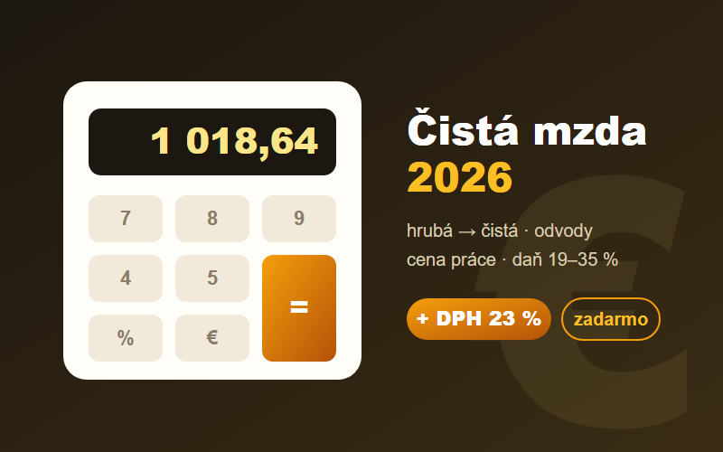

# Mzdová kalkulačka 2026 💶

Bezplatná mzdová kalkulačka pre Slovensko. Vypočíta čistú mzdu z hrubej podľa legislatívy platnej pre rok 2026, s kompletným rozpisom odvodov, daní aj ceny práce zamestnávateľa. Súčasťou je aj DPH kalkulačka (23 / 19 / 5 % plus vlastná sadzba).

**▶ Živá ukážka: [mokanmart.in/mzdova-kalkulacka](https://mokanmart.in/mzdova-kalkulacka)**



## Čo počíta

Čistá mzda z hrubej podľa pravidiel roka 2026:

* odvody zamestnanca: zdravotné 5 % (ZŤP 2,5 %), sociálne 9,4 % (nemocenské 1,4 / starobné 4 / invalidné 3 / v nezamestnanosti 1), max. vymeriavací základ pre SP 16 764 €/mes.
* nové daňové pásma 19 / 25 / 30 / 35 % (hranice mesačného základu 3 665,28 / 5 029,10 / 6 250,86 €)
* nezdaniteľná časť 497,23 €/mes. pri podpísanom vyhlásení

Ďalej cena práce, teda kompletný rozpis odvodov zamestnávateľa (36,2 %), a DPH kalkulačka s pripočítaním aj odpočítaním dane.

Výpočet je overený proti oficiálne publikovaným príkladom (napríklad hrubá mzda 915 € dáva čistú 728,90 €). Legislatívne konštanty sú v jednom prehľadnom bloku na začiatku súboru [`src/MzdovaKalkulacka.tsx`](src/MzdovaKalkulacka.tsx), takže pri ročnej zmene zákona sa upraví len tento blok.

## Technológie

* React 18, TypeScript, Vite, žiadne ďalšie závislosti
* beží celé v prehliadači, nič sa neodosiela na server
* dvojjazyčné rozhranie (SK/EN)
* výsledný bundle má okolo 10 kB (gzip 3,3 kB)

## Spustenie

```bash
npm install
npm run dev
```

## Licencia

MIT © [Martin Mokaň](https://mokanmart.in), fullstack vývojár. Ďalšie bezplatné nástroje nájdeš na [mokanmart.in](https://mokanmart.in/#tools).

> Výpočty sú orientačné a nie sú daňovým poradenstvom.
